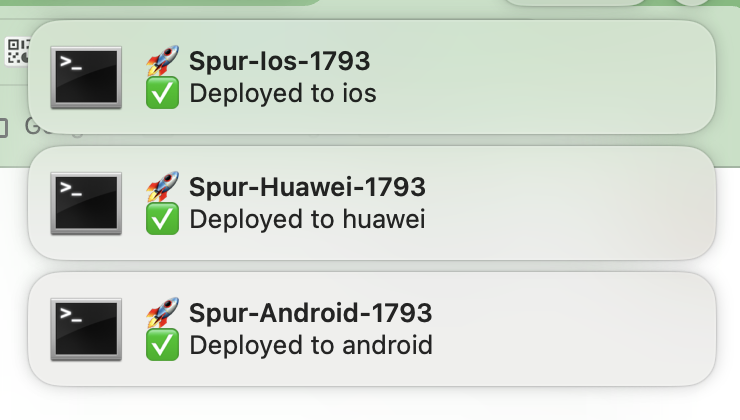

# 🚀 Modular Local Deployment Toolkit

This folder contains **everything** you need to fully automate the release process for a Flutter project targeting **Android (Google Play & Huawei AppGallery)** and **iOS (TestFlight / App Store)**.

Copy the entire `deployment/` directory and the two `fastlane/` directories (`ios/fastlane` and `android/fastlane`) to any other project, adjust one env-file, and you are good to go.

---

## 📚 Table of Contents

- [1. Folder Overview](#1-folder-overview)
- [2. Quick-start](#2-quick-start)
- [3. Environment variables (`deploy.env`)](#3-environment-variables-deployenv)
- [4. How to obtain required credentials](#4-how-to-obtain-required-credentials)
  - [🤖 Google Play Store (`PLAYSTORE_KEY`)](#-google-play-store-playstore_key)
  - [🔶 Huawei AppGallery (`HUAWEI_APP_ID`, `HUAWEI_CLIENT_ID`, `HUAWEI_CLIENT_SECRET`)](#-huawei-appgallery-huawei_app_id-huawei_client_id-huawei_client_secret)
  - [🍎 App Store Connect (`APP_STORE_CONNECT_KEY_ID`, `APP_STORE_CONNECT_ISSUER_ID`, `APP_STORE_CONNECT_KEY_CONTENT`)](#-app-store-connect-app_store_connect_key_id-app_store_connect_issuer_id-app_store_connect_key_content)
  - [🔐 Security Best Practices](#-security-best-practices)
- [5. Fastlane Integration](#5-fastlane-integration)
- [6. Tips & Tricks](#6-tips--tricks)
  - [Debug Mode](#debug-mode)
  - [Multi-Platform Deployment](#multi-platform-deployment)
  - [Build Number Management](#build-number-management)
  - [Platform Configuration](#platform-configuration)
  - [Notifications](#notifications)
    - [macOS Desktop Notifications](#macos-desktop-notifications)

---

## 1. Folder Overview

```
deployment/
  deploy.sh            – main orchestrator script
  deploy.env           – YOUR variables go here (never commit plain secrets!)
  deploy.env.example   – template with all required keys
  .gitignore           – excludes sensitive files and build artifacts
  examples/            – Ready-to-use Fastlane example setups (ios/ and android/)
  scripts/
      common.sh          – logging, cleanup, requirement checks
      env_check.sh       – verifies env vars for chosen platform
      keystore.sh        – writes key.properties & keystore files
      versioning.sh      – bumps build number in pubspec.yaml
      browserstack.sh    – upload apk/ipa & generate QA link
      slack.sh           – Slack helper (uses chat.postMessage)
      notification.sh    – macOS notification helper
      deploy_platform.sh – builds & uploads for a single platform
  releases/            – generated aab/ipa files are copied here
```

Your project should also have `ios/fastlane/` and `android/fastlane/` directories. You can use the examples provided in `deployment/examples/` as a starting point, or adapt your existing Fastlane setup. These Fastlane configurations should rely entirely on environment variables provided by this deployment system (see `deploy.env.example`).

---

## 2. Quick-start

```bash
# 1) Copy the deployment toolkit to your project's root
#    (Assumes this 'deployment' folder is not yet in your project)

# 2) Navigate into the deployment directory within your project
#    All subsequent setup commands assume you are in this directory unless specified otherwise.
cd deployment

# 3) Set up Fastlane in your project
#    Copy the example Fastlane setups:
cp -R examples/ios/ ../ios/
cp -R examples/android/ ../android/


# 4) Configure secrets for the deployment toolkit
#    (Still in <YOUR_PROJECT>/deployment/)
cp deploy.env.example deploy.env
vim deploy.env   # Or any editor – fill in your secrets

# 5) Install Fastlane dependencies for each platform
cd ../ios && bundle install && cd ../deployment
cd ../android && bundle install && cd ../deployment
#    (The 'cd ../deployment' returns you here for convenience if needed)

# 6) Ship! (Run from your project root: <YOUR_PROJECT>/)
cd ..
#    Example: Deploy Android to Google Play
./deployment/deploy.sh -p android

# More examples (run from <YOUR_PROJECT>/ root):
# ./deployment/deploy.sh -p ios
# ./deployment/deploy.sh -p huawei # (if HUAWEI_ENABLED="true")
# ./deployment/deploy.sh -p android,ios
# ./deployment/deploy.sh -p all
# ./deployment/deploy.sh -p android -n 42
# DEBUG=true ./deployment/deploy.sh -p android
```

### 🆕 Key Features

- **✅ Optional Build Numbers**: The `-n` parameter is now optional.
- **✅ Multi-Platform Support**: Deploy to multiple platforms in one command.
- **✅ Configurable Platform Support**: Easily disable Huawei, BrowserStack, or Slack notifications via `deploy.env`.
- **✅ Enhanced Error Handling**: Comprehensive validation and error reporting.
- **✅ Improved Path Resolution**: Robust file path handling for AAB and IPA files.
- **✅ Credential Validation**: Automatic validation of required credentials (only if features are enabled).
- **✅ Environment Variable Export**: Proper export of environment variables to Fastlane processes.
- **✅ Comprehensive .gitignore**: Deployment-specific gitignore.

The script will:
1. Verify required tools (`fvm`, `git`, `jq`, `curl`, etc.).
2. Validate that **all** needed env vars are present for selected platforms.
3. Determine build number (auto-increment current or use provided value) and update `pubspec.yaml`.
4. Build the Flutter app for your selected platform(s).
5. Upload the artefact to BrowserStack and send a Slack QA link.
6. Upload to Google Play / Huawei AppGallery / TestFlight via Fastlane.
7. Show a macOS desktop notification (optional).

---

## 3. Environment variables (`deploy.env`)
The example file `deploy.env.example` is heavily commented and serves as the template.
You should copy it to `deploy.env` and fill in your secrets.
Below is a summary of key variables:

```bash
# ── Shared Configuration ──────────────────────────────────
# Platform Support
# Feature Toggles (set to "false" to disable specific features)
HUAWEI_ENABLED="true"              # Disable Huawei AppGallery support
BROWSERSTACK_ENABLED="true"        # Disable BrowserStack uploads for QA
SLACK_NOTIFICATIONS_ENABLED="true" # Disable Slack notifications

# App Naming (optional - defaults based on branch)
APP_PREFIX="MyApp"
PACKAGE_NAME="com.example.myapp" # e.g., com.yourcompany.appname

# Slack Notifications
SLACK_TOKEN="xoxb-YOUR_SLACK_BOT_TOKEN"
SLACK_CHANNEL="#app-testing"    # Channel for deployment notifications (Mandatory if Slack enabled)
USER_TO_TAG="U123ABCDEF"        # Slack User ID to mention (e.g., QA lead) (Mandatory if Slack enabled)
DEV_USER_ID="UDEFGH123"         # Optional: Slack User ID for dev-specific pings (e.g., for test_app branch failures)

# BrowserStack (for QA testing links)
BROWSERSTACK_API_USERNAME="your_browserstack_username"
BROWSERSTACK_API_PASSWORD="your_browserstack_access_key"

# ── Android Configuration ─────────────────────────────────

# Keystore for Production (master branch)
PRODUCTION_KEYSTORE="base64_of_production_keystore_jks_file"
PRODUCTION_KEYSTORE_PASSWORD="production_keystore_password"
PRODUCTION_KEY_PASSWORD="production_key_password"
PRODUCTION_KEY_ALIAS="production_key_alias"

# Keystore for Development/Testing (non-master branches)
DEV_KEYSTORE="base64_of_development_keystore_jks_file"
DEV_KEYSTORE_PASSWORD="development_keystore_password"
DEV_KEY_PASSWORD="development_key_password"
DEV_KEY_ALIAS="development_key_alias"

# Google Play Store Service Account
PLAYSTORE_KEY="base64_of_google_play_service_account_json_file"
GOOGLE_PLAY_TRACK="internal"      # Target track: internal, alpha, beta, production

# ── Huawei AppGallery Configuration ───────────────────────
# (Only needed if HUAWEI_ENABLED="true")
HUAWEI_APP_ID="your_huawei_app_id"         # App ID from AppGallery Connect
HUAWEI_CLIENT_ID="your_huawei_api_client_id"      # API Client ID (must differ from App ID)
HUAWEI_CLIENT_SECRET="your_huawei_api_client_secret" # API Client Secret

# ── iOS Configuration ─────────────────────────────────────
# App Store Connect API Key
APP_STORE_CONNECT_KEY_ID="YOUR_KEY_ID"
APP_STORE_CONNECT_ISSUER_ID="YOUR_ISSUER_ID"
APP_STORE_CONNECT_KEY_CONTENT="base64_of_app_store_connect_api_p8_file"

# iOS App Details
IOS_APP_IDENTIFIER="com.example.myapp_ios" # Your app's bundle ID
IOS_APPLE_ID="your_apple_developer_email@example.com"
IOS_TEAM_ID="YOUR_APPLE_TEAM_ID"         # Found in Apple Developer Account
IOS_ITC_TEAM_ID="YOUR_ITC_TEAM_ID"       # Optional: App Store Connect Team ID
```

**Important Notes:**
- Refer to `deploy.env.example` for the complete list of all available variables and more detailed comments.
- Run `cat myfile | base64` to convert binary files (like `.jks`, `.json`, `.p8`) to base64 strings.
- For Huawei (if enabled): `HUAWEI_CLIENT_ID` must be different from `HUAWEI_APP_ID`.
- The script validates required credentials before starting any deployment.

---

## 4. How to obtain required credentials

### 🤖 Google Play Store (`PLAYSTORE_KEY`)

1. **Create a Service Account**:
   - Go to [Google Cloud Console](https://console.cloud.google.com/)
   - Select your project (or create one)
   - Navigate to **IAM & Admin** → **Service Accounts**
   - Click **Create Service Account**
   - Give it a name like "Google Play Deploy"

2. **Generate JSON Key**:
   - Click on your service account
   - Go to **Keys** tab → **Add Key** → **Create new key**
   - Choose **JSON** format and download the file
   - Convert to base64: `cat service-account.json | base64`

3. **Grant Play Console Access**:
   - Go to [Google Play Console](https://play.google.com/console/)
   - Navigate to **Setup** → **API access**
   - Link your Google Cloud project
   - Grant access to your service account with appropriate permissions

📖 **Detailed Guide**: [Fastlane Google Play Setup](https://docs.fastlane.tools/actions/upload_to_play_store/)

### 🔶 Huawei AppGallery (`HUAWEI_APP_ID`, `HUAWEI_CLIENT_ID`, `HUAWEI_CLIENT_SECRET`)

1. **Register as Huawei Developer**:
   - Sign up at [Huawei Developer Console](https://developer.huawei.com/consumer/en/)
   - Complete identity verification

2. **Create App in AppGallery Connect**:
   - Go to [AppGallery Connect](https://developer.huawei.com/consumer/en/service/josp/agc/index.html)
   - Create a new project and app
   - Note down the **App ID** (`HUAWEI_APP_ID`)

3. **Generate API Credentials**:
   - In AppGallery Connect, go to **Users and permissions** → **API client**
   - Create a new API client
   - Download the credentials file or copy:
     - **Client ID** (`HUAWEI_CLIENT_ID`) - This should be different from your App ID
     - **Client Secret** (`HUAWEI_CLIENT_SECRET`)

⚠️ **Critical**: The `HUAWEI_CLIENT_ID` is different from `HUAWEI_APP_ID`. The App ID identifies your app, while the Client ID is for API authentication. **This is the most common cause of Huawei deployment failures.** Make sure you're using the correct values from the API client settings, not the app settings.

📖 **Detailed Guide**: [Huawei Publishing API](https://developer.huawei.com/consumer/en/doc/development/AppGallery-connect-Guides/agcapi-getstarted)

### 🍎 App Store Connect (`APP_STORE_CONNECT_KEY_ID`, `APP_STORE_CONNECT_ISSUER_ID`, `APP_STORE_CONNECT_KEY_CONTENT`)

1. **Create App Store Connect API Key**:
   - Go to [App Store Connect](https://appstoreconnect.apple.com/access/integrations/api)
   - Navigate to **Users and Access** → **Integrations** → **App Store Connect API** tab
   - Click **Generate API Key** (requires Developer role)
   - Give it a name and select **Developer** access role
   - Download the `.p8` file immediately (you can't download it again!)

2. **Gather Required Information**:
   - **Key ID** (`APP_STORE_CONNECT_KEY_ID`): Found in the key details after creation
   - **Issuer ID** (`APP_STORE_CONNECT_ISSUER_ID`): Found at the top of the Keys page
   - **Key Content** (`APP_STORE_CONNECT_KEY_CONTENT`): Convert the `.p8` file to base64:
     ```bash
     cat AuthKey_XXXXXXXXXX.p8 | base64
     ```

3. **Additional App Information**:
   - **App Identifier** (`IOS_APP_IDENTIFIER`): Your app's bundle ID (e.g., `com.example.myapp`)
   - **Apple ID** (`IOS_APPLE_ID`): Your Apple Developer account email
   - **Team ID** (`IOS_TEAM_ID`): Found in [Apple Developer Account](https://developer.apple.com/account/) → Membership
   - **iTunes Connect Team ID** (`IOS_ITC_TEAM_ID`): Found in [App Store Connect](https://appstoreconnect.apple.com/WebObjects/iTunesConnect.woa/ra/user/detail) under `associatedAccounts[].contentProvider.contentProviderId` in the JSON response

📖 **Detailed Guide**: [App Store Connect API](https://developer.apple.com/documentation/appstoreconnectapi/creating_api_keys_for_app_store_connect_api)

### 🔐 Security Best Practices

- **Never commit** your `deploy.env` file to version control
- Store credentials in a secure password manager
- Rotate API keys regularly
- Use the principle of least privilege for service accounts
- Consider using CI/CD environment variables instead of local files for production
- The deployment system includes a comprehensive `.gitignore` to prevent accidental commits

---

## 5. Fastlane Integration

This deployment system is designed to work seamlessly with Fastlane. Your project's `ios/fastlane/` and `android/fastlane/` directories should contain Fastlane setups that are driven by environment variables.

**You have two main options for your Fastlane setup:**

1.  **Use Provided Examples**: The `deployment/examples/` directory contains ready-to-copy Fastlane configurations for both iOS and Android. These are pre-configured to work with the environment variables defined in `deploy.env.example`.

2.  **Adapt Your Existing Fastlane Setup**: Ensure your existing Fastfiles in `ios/fastlane/` and `android/fastlane/` are configured to use environment variables for all sensitive or project-specific values.

---

## 6. Tips & Tricks

### Debug Mode

To skip git checks and Slack notifications, set the `DEBUG` environment variable to `true`:

```bash
DEBUG=true ./deployment/deploy.sh -p android
```

### Multi-Platform Deployment

Deploy to multiple platforms in one command:

```bash
./deployment/deploy.sh -p android,ios
```

### Build Number Management

The script automatically increments the build number in `pubspec.yaml` for each deployment. You can also specify a specific build number:

```bash
./deployment/deploy.sh -p android -n 42
```

### Platform Configuration

Easily disable Huawei, BrowserStack, or Slack notifications by setting the corresponding variables in `deploy.env`:

```bash
# Disable Huawei AppGallery support
HUAWEI_ENABLED="false"

# Disable BrowserStack uploads for QA
BROWSERSTACK_ENABLED="false"

# Disable Slack notifications
SLACK_NOTIFICATIONS_ENABLED="false"
```

### Notifications
The deployment system provides comprehensive notifications to keep you informed of deployment progress:

#### macOS Desktop Notifications
After successful deployment to each platform, you'll receive native macOS notifications showing:
- 🚀 **App name and build number** (e.g., "Spur-ios-1793")
- ✅ **Deployment status** with platform name
- 🎯 **Platform-specific details** (iOS, Android, Huawei)
When BrowserStack is enabled, clicking the notification opens your BrowserStack app testing page directly in your browser.





